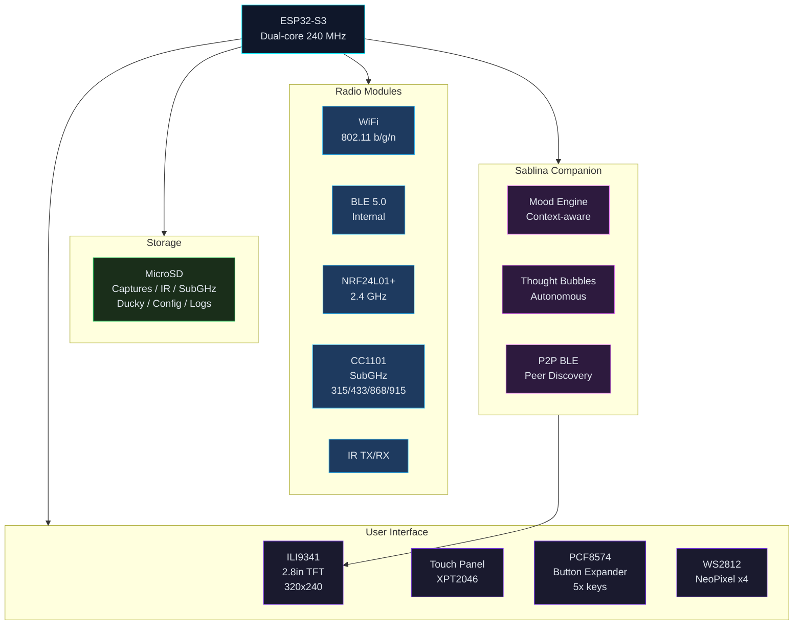
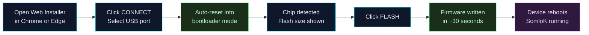
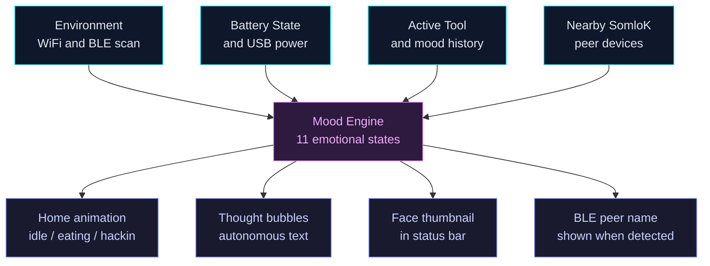

<div align="center">

<br />

<h1>
  
</h1>

<p><strong>Unified wireless research firmware for the ESP32-DIV V2</strong><br/>
Built for education, authorized lab testing, and RF protocol research.</p>

<br/>

<a href="https://ICBizLabs.github.io/ESP32-DIV-KILAZ/">
  
</a>
&nbsp;

&nbsp;
<a href="LICENSE">
  
</a>
&nbsp;
<a href="DISCLAIMER.md">
  
</a>
&nbsp;


<br /><br />

</div>

---

## Demo

<div align="center">
  <video src="media/demo-ghost-humandetect.mp4" width="270" controls loop></video>
  <br/><br/>
  <sub>
    <strong>Ghost Detector</strong>,  scans the air for WiFi probe requests and beacon frames from devices that aren't visible as normal networks;<br/>
    highlights "ghost" APs that appear and vanish, useful for detecting hidden or ephemeral transmitters.<br/>
    <strong>Human Detector</strong>,  uses passive 802.11 RSSI triangulation to estimate human presence near the device;<br/>
    shows a live signal-strength graph as people move in and out of range.
  </sub>
</div>

---

## What is SomloK?

**SomloK** is a custom firmware for the **ESP32-DIV V2**, a compact multi-radio research board powered by the ESP32-S3. It transforms the hardware into a fully interactive, menu-driven wireless research station that fits in your pocket.

From passive 802.11 frame analysis to SubGHz signal replay, from BLE advertisement inspection to infrared capture, SomloK consolidates every tool into a single, polished interface with a color TFT display, physical buttons, touch input, and RGB LED activity indicators.

At its heart lives **Sablina**, an autonomous AI-style companion that displays real-time context, reacts to what the device is doing, and keeps you oriented at a glance.

> **SomloK is designed exclusively for authorized lab environments, academic research, and personal device testing. Never use any wireless research tool against networks, devices, or infrastructure without explicit written permission from the owner.**

---

## At a Glance

| Domain | Tools |
|---|---|
| 📡 **WiFi / 802.11** | Packet Monitor, Beacon Research, Disassociation Research, Deauth Detector, Scanner, Ghost Detector, People Detector, Captive Portal |
| 🔵 **BLE / Bluetooth** | Scanner, Sniffer, Advertisement Simulator, Notification Simulator, HID Payload Research, Interference Research |
| 📶 **2.4 GHz / NRF24** | Channel Scanner, Signal Analyzer, Wideband Research, Protocol Stress Test |
| 📻 **Sub-GHz / CC1101** | Signal Capture & Replay, Sequential Code Analysis, Saved Profiles, Spectrum Analyzer |
| 🔴 **Infrared** | Signal Capture, Saved Profiles |
| 🛠️ **System** | Web Control, Signal Library, Signal Lab, RF Hot/Cold, File Manager, OTA Update, Serial Monitor |

---

## System Architecture



---

## Feature Map

```mermaid
flowchart LR
    classDef root fill:#0f172a,stroke:#00e5ff,color:#e2e8f0,font-weight:bold
    classDef wifi fill:#1e3a5f,stroke:#38bdf8,color:#bfdbfe
    classDef ble fill:#1a1a3e,stroke:#818cf8,color:#c7d2fe
    classDef nrf fill:#1e2d40,stroke:#22d3ee,color:#a5f3fc
    classDef sub fill:#2d1e00,stroke:#f59e0b,color:#fde68a
    classDef ir fill:#2d1a1a,stroke:#f87171,color:#fecaca
    classDef tools fill:#1a2e1a,stroke:#4ade80,color:#bbf7d0
    classDef sys fill:#1e1a2d,stroke:#c084fc,color:#e9d5ff

    MAIN["SomloK"]:::root

    MAIN --> W["WiFi"]:::wifi
    MAIN --> B["BLE"]:::ble
    MAIN --> N["2.4 GHz"]:::nrf
    MAIN --> S["Sub-GHz"]:::sub
    MAIN --> I["IR"]:::ir
    MAIN --> T["Tools"]:::tools
    MAIN --> SY["Settings"]:::sys

    W --> W1["Packet Monitor"]:::wifi
    W --> W2["Beacon Research"]:::wifi
    W --> W3["Disassoc. Research"]:::wifi
    W --> W4["Deauth Detector"]:::wifi
    W --> W5["WiFi Scanner"]:::wifi
    W --> W6["Ghost Detector"]:::wifi
    W --> W7["People Detector"]:::wifi
    W --> W8["Captive Portal"]:::wifi

    B --> B1["BLE Scanner"]:::ble
    B --> B2["Passive Sniffer"]:::ble
    B --> B3["Advert. Simulator"]:::ble
    B --> B4["Notif. Simulator"]:::ble
    B --> B5["HID Research"]:::ble
    B --> B6["Interference Lab"]:::ble

    N --> N1["Channel Scanner"]:::nrf
    N --> N2["Signal Analyzer"]:::nrf
    N --> N3["Wideband Lab"]:::nrf
    N --> N4["Protocol Stress"]:::nrf

    S --> S1["Capture and Replay"]:::sub
    S --> S2["Sequential Analysis"]:::sub
    S --> S3["Spectrum Analyzer"]:::sub
    S --> S4["Saved Profiles"]:::sub

    I --> I1["IR Capture"]:::ir
    I --> I2["IR Replay"]:::ir

    T --> T1["Web Control"]:::tools
    T --> T2["Signal Library"]:::tools
    T --> T3["Signal Lab"]:::tools
    T --> T4["RF Hot/Cold"]:::tools
    T --> T5["File Manager"]:::tools
    T --> T6["OTA Update"]:::tools
    T --> T7["Full Suite"]:::tools

    SY --> SY1["Themes x6"]:::sys
    SY --> SY2["Brightness"]:::sys
    SY --> SY3["NeoPixel Control"]:::sys
```



---

## Hardware

### Required Board

| Component | Spec |
|---|---|
| **MCU** | ESP32-S3, Dual-core Xtensa LX7, 240 MHz |
| **Flash** | 16 MB |
| **RAM** | 512 KB SRAM |
| **Display** | ILI9341, 2.8" TFT, 320×240, SPI |
| **Touch** | XPT2046 resistive touch controller |
| **SubGHz radio** | CC1101, 315 / 433 / 868 / 915 MHz |
| **2.4 GHz radio** | NRF24L01+ |
| **Infrared** | IR TX + RX pair |
| **BLE / WiFi** | ESP32-S3 internal (BLE 5.0 + 802.11 b/g/n) |
| **Input** | PCF8574 I2C button expander (5 keys) + touch |
| **RGB LEDs** | 4× WS2812B NeoPixel |
| **Storage** | MicroSD card slot |

### Compatible Boards

| Board | Chip | Status |
|---|---|---|
| ESP32-DIV V2.0 | ESP32-S3 | ✅ Supported |
| ESP32-DIV V2.1 | ESP32-S3 | ✅ Supported |
| ESP32-DIV V1 | ESP32 | ❌ Not supported |

### Board Revision Differences

SomloK **auto-detects** the board revision at boot by scanning I2C bus combinations and address ranges. No manual configuration needed.

| | V2.0 | V2.1 |
|---|---|---|
| PCF8574 I2C Address | `0x20` | `0x27` |
| I2C Pins | Varies | SDA=8, SCL=9 |
| Button Stability | Falls back to touch-only if unstable | Stable |
| Extra I2C Device | `0x55` (EEPROM?) present | Not present |

---

## Flash the Firmware

### Option 1, Web Installer (Recommended)

No drivers, no IDE, no terminal. Works directly from your browser.

**[→ Launch Web Installer](https://ICBizLabs.github.io/ESP32-DIV-KILAZ/)**

**Requirements:**
- Chrome or Edge (desktop), Web Serial API required
- ESP32-DIV V2 or V2.1 board
- USB cable connected to the board



The flasher performs a **1200-baud touch reset** automatically, you do not need to hold the BOOT button or press RESET manually.

### Option 2, Local Server (No Internet)

```bash
git clone https://github.com/ICBizLabs/ESP32-DIV-KILAZ.git
cd ESP32-DIV-KILAZ
python3 tools/serve_flasher.py
# Open http://localhost:8080/tools/flasher.html
```

---

## Features In Depth

### 📡 WiFi / 802.11

| Tool | Description |
|---|---|
| **Packet Monitor** | Captures and displays 802.11 frames in real time, useful for inspecting traffic patterns on authorized networks |
| **Beacon Research** | Generates multiple 802.11 beacon frames for testing how client devices and IDS/IPS systems handle SSID flooding |
| **Disassociation Research** | Sends 802.11 disassociation frames against your own lab devices to observe reconnection behavior and driver responses |
| **Deauth Detector** | Passively listens for disassociation frame bursts, useful for detecting rogue tools on your network |
| **WiFi Scanner** | Lists visible access points with SSID, BSSID, RSSI, channel, and encryption type |
| **Ghost Detector** | Identifies hidden or inconsistently beaconing networks |
| **People Detector** | Estimates the number of active 802.11 devices in range using probe request analysis |
| **Captive Portal** | Hosts a local access point with a configurable landing page for authorized portal simulation research |

### 🔵 BLE / Bluetooth

| Tool | Description |
|---|---|
| **BLE Scanner** | Discovers nearby BLE devices, shows address, name, RSSI, and advertisement data |
| **Passive Sniffer** | Logs raw BLE advertisement packets for offline analysis |
| **Advertisement Simulator** | Broadcasts custom BLE advertisement payloads for testing how clients respond |
| **Notification Simulator** | Simulates BLE pairing and notification prompts for iOS proximity research |
| **HID Payload Research** | Injects HID keyboard sequences over BLE against authorized target devices |
| **Interference Research** | Generates wideband BLE channel activity for authorized RF lab environments |

### 📶 2.4 GHz / NRF24

| Tool | Description |
|---|---|
| **Channel Scanner** | Scans all 125 NRF24 channels and reports activity levels |
| **Signal Analyzer** | Plots per-channel RSSI over time for spectrum analysis |
| **Wideband Lab** | Generates continuous 2.4 GHz channel activity for interference characterization in isolated lab environments |
| **Protocol Stress Test** | Sends NRF24 protocol frames to evaluate receiver device resilience |

### 📻 Sub-GHz / CC1101

Operates across **315 MHz**, **433.92 MHz**, **868.35 MHz**, and **915 MHz** bands.

| Tool | Description |
|---|---|
| **Signal Capture & Replay** | Records a SubGHz transmission and replays it, used to verify your own remotes and sensors |
| **Sequential Code Analysis** | Iterates through the fixed-code space of PT2262 / EV1527 class devices for research |
| **Spectrum Analyzer** | Live waterfall heatmap, X axis: frequency, Y axis: time, color: RSSI |
| **Protocol Decoder** | Decodes RCSwitch-compatible fixed-code remotes, shows value, bit length, and protocol ID |
| **SubGHz Interference Lab** | Generates SubGHz channel activity for isolated RF lab environments |
| **Saved Profiles** | Stores and recalls captured signal banks from SD card |

### 🔴 Infrared

| Tool | Description |
|---|---|
| **IR Capture** | Records any IR remote signal and stores it to the SD card |
| **IR Replay** | Plays back stored IR signals, for verifying captures and building custom IR signal libraries |

### 🛠️ System Tools

| Tool | Description |
|---|---|
| **Web Control** | Starts a local AP and serves a management dashboard, view device state, adjust theme, upload and delete SD files |
| **Signal Library** | Unified browser for IR and SubGHz files on SD, validates and imports into canonical libraries |
| **Signal Lab** | Interactive workspace for building and testing custom signal sequences |
| **RF Hot/Cold** | Proximity guide, SubGHz RSSI meter or 2.4 GHz strongest beacon tracker to locate a signal source |
| **File Manager** | On-device SD browser for `/captures`, `/subghz`, `/ir`, `/ducky`, `/logs`, `/config` |
| **SD Health** | Reports SD card status, free space, and file system integrity |
| **OTA Update** | Flash new firmware directly from the device menu |
| **Full Suite** | Launches the complete tool catalog as a sequential workflow |
| **Tool Catalog** | Searchable index of every installed tool with descriptions |
| **Serial Monitor** | Live UART output viewer |
| **Touch Calibrate** | Recalibrates the XPT2046 resistive touch panel |

---

## Sablina, The Companion

Sablina is the animated AI companion on the SomloK home screen. She is not decorative, she is a real-time context engine.



| Mood | Trigger |
|---|---|
| `idle` | Low signal environment, default state |
| `hackin` | Any active research tool running |
| `eating` | Positive social states, personal bond active |
| `smiling` | Bond detected with nearby Sablina peer |
| `dancing` | High-energy autonomous activity |
| `screaming` | Error or fault state |
| `crying` | Extended disconnected or low-signal state |
| `sad / tired` | Battery low or sustained inactivity |
| `sleeping` | Deep idle after long timeout |
| `close-up` | Peer proximity detected |

Sablina also supports **BLE peer-to-peer discovery**, when two SomloK devices are in range, each detects the other and shows a live thought bubble with the peer's name.

---

## UI, Themes & LEDs

### Themes

Six built-in color themes, selectable live from `Settings`:

| Theme | Description |
|---|---|
| **Dark** | Classic dark mode with neutral accents |
| **Light** | High-contrast light mode |
| **AMOLED** | True black with bright pop accents |
| **Ice Lab** | Cool blue-cyan palette |
| **Signal Amber** | Warm amber-on-black retro terminal style |
| **Abyss Bloom** | Deep teal shadows, coral icons, mint accents, custom SomloK palette |

### NeoPixel Activity Indicators

The 4 WS2812B LEDs at the top of the board show active tool category at a glance:

| LED Pattern | Meaning |
|---|---|
| 🔵 Blue sweep | WiFi tool active |
| 💜 Cyan + magenta pulse | BLE tool active |
| 🟢 Fast green scan | 2.4 GHz tool active |
| 🟡 Amber sweep | SubGHz tool active |
| 🔴 Red pulse | IR tool active |
| 🟣 Purple stepped fill | HID payload tool active |
| ⚪ White + green status | Settings or system page |
| Off | No tool running |

### Button LED Feedback

| Button | Flash Color |
|---|---|
| UP | Light blue |
| LEFT | Amber |
| RIGHT | Magenta |
| DOWN | Green |
| SELECT | White |

---

## SD Card Structure

SomloK uses a MicroSD card for all persistent data. Expected folder layout:

```
/
├── config/
│   ├── sablina_idle.sblv       ← Sablina idle animation
│   ├── sablina-hackin.sblv     ← Sablina tool-active animation
│   ├── sablina-eating.sblv     ← Sablina social animation
│   └── settings.json           ← Theme, brightness, saved preferences
├── captures/                   ← Raw captured signal files
├── subghz/                     ← SubGHz signal banks
├── ir/                         ← IR signal files (ir_XXXX.bin)
├── ducky/                      ← HID payload scripts
└── logs/                       ← Diagnostic and capture logs
```

---

## Repository Structure

```
README.md
tools/
  flasher.html                              ← Web flasher (Chrome/Edge)
  serve_flasher.py                          ← Local dev server
firmware/
  SomloK/
    version.json                            ← Current firmware version
    README.md                               ← Firmware-specific docs
    build/
      esp32.esp32.esp32s3/
        SomloK.ino.bootloader.bin           ← Bootloader  (0x0000)
        SomloK.ino.partitions.bin           ← Partition table  (0x8000)
        SomloK.ino.bin                      ← Application firmware  (0x10000)
media/
  sablina-idle.mp4
  sablina-hackin.mp4
  sablina-smiling.mp4
  sablina-screaming.mp4
  sablina-dance.mp4
```

> Source code is not included in this repository. Only compiled binaries are distributed.

---

## Flash Memory Footprint

| Region | Usage |
|---|---|
| Application flash | 1,449,345 bytes, 46% of 16 MB partition |
| Global RAM | 111,276 bytes, 33% of 336 KB |

---

## Legal & Ethical Use

SomloK contains tools that interact with wireless protocols including IEEE 802.11, Bluetooth Low Energy, Sub-GHz ISM bands, NRF24-compatible 2.4 GHz channels, and infrared signals.

**These tools are provided exclusively for:**
- Authorized assessments with explicit written permission from the infrastructure owner
- Academic and educational research in controlled lab environments
- Testing your own devices and infrastructure
- CTF (Capture The Flag) competitions and authorized challenges

**You are solely responsible** for ensuring that your use of this firmware complies with all applicable local, national, and international laws and regulations. The authors accept no liability for misuse.

In many jurisdictions, transmitting on certain frequencies or causing wireless interference, even briefly, without authorization is a criminal offense.

| Document | Purpose |
|---|---|
| [LICENSE](LICENSE) | MIT License,  software code |
| [DISCLAIMER.md](DISCLAIMER.md) | Full legal disclaimer, indemnification & terms of use,  **read before using** |
| [SECURITY.md](SECURITY.md) | Vulnerability reporting & responsible disclosure policy |

---

## Issues & Feedback

Found a bug? Discovered a board variant? Have a question?

**[→ Open an issue](https://github.com/ICBizLabs/ESP32-DIV-KILAZ/issues)**

---

<div align="center">

Built with an ESP32-S3, a CC1101, and a lot of stubbornness.<br/>
<sub>SomloK, Wireless Research Firmware, For authorized use only.</sub>

</div>
